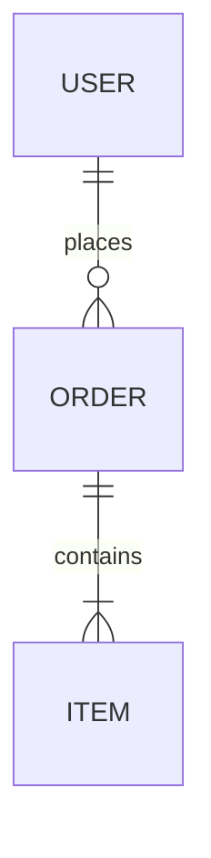

# /handover-api — API & Integrations Reference

Produces deliverable **03**: a reference for every interface the system exposes or consumes — internal/public APIs, webhooks, and third-party integrations — plus the data schema. Mark this doc **N/A** in the master index if the product has no API or external integrations.

> **Shared contract** — output location & numbering, secrets → doc 05, actual-state-not-plan, cross-referencing, and completeness rules live in [`handover/references/handover-conventions.md`](../handover/references/handover-conventions.md). Follow it; don't restate it.

## When to use

- The product exposes a REST/GraphQL/gRPC API the client or their partners will call.
- The product integrates with external services (payments, auth, email, maps, analytics, etc.).
- The client needs to understand the data schema to build on or migrate the system.

## Inputs to gather (scan first)

- Route definitions / controllers / OpenAPI/Swagger specs / GraphQL schema.
- Auth middleware (API keys, OAuth, JWT, sessions).
- Webhook senders/receivers and event payloads.
- Third-party SDK usage and the accounts behind them (cross-reference doc 05 for credentials).
- DB migrations / ORM models for the schema and ERD.

## Process

1. Catalogue **endpoints**: method, path, purpose, auth required, key params, sample request/response.
2. Document the **authentication & authorization** model and how to obtain/rotate credentials.
3. Document **webhooks/events**: triggers, payloads, retry behaviour, signature verification.
4. List **third-party integrations**: provider, purpose, which account/key, where configured, failure behaviour, cost/plan.
5. Provide the **data schema / ERD** — tables/collections, key fields, relationships, important indexes/constraints.
6. Note **rate limits, versioning, and deprecation** policy.

## Output template — `handover/03-api-integrations.md`

```markdown
# API & Integrations Reference — <Project Name>

**Base URL(s):** prod `<url>` · staging `<url>`  ·  **API version:** <v1>
**Spec:** <link to OpenAPI/GraphQL schema if available>

## 1. Authentication
<Scheme (API key / OAuth2 / JWT). How to obtain a token, lifetime, refresh, rotation. Credentials sourced from doc 05.>

## 2. Endpoint catalogue

### `POST /resource`
- **Purpose:** <...>
- **Auth:** required (scope: <...>)
- **Request:**
  ```json
  { "field": "value" }
  ```
- **Response 200:**
  ```json
  { "id": "...", "field": "value" }
  ```
- **Errors:** 400 <...>, 401 <...>, 409 <...>

<Repeat per endpoint, or reference the OpenAPI spec and list only the highlights.>

## 3. Webhooks / events

| Event | Trigger | Payload | Retries | Signature |
|-------|---------|---------|---------|-----------|
| | | | | |

## 4. Third-party integrations

| Provider | Purpose | Account / key (see doc 05) | Configured in | Plan / cost | Failure behaviour |
|----------|---------|----------------------------|---------------|-------------|-------------------|
| | | | | | |

## 5. Data schema / ERD


| Table / collection | Key fields | Relationships | Notes (indexes, constraints) |
|--------------------|-----------|---------------|------------------------------|
| | | | |

## 6. Rate limits, versioning & deprecation
<Limits, how versions are introduced, deprecation policy and notice period.>
```

## Quality checklist

- Every endpoint states its auth requirement and at least one realistic example.
- Each integration names the owning account and where it's configured — keys themselves live in doc 05, not here.
- The ERD matches the actual migrations/models.
- Webhook docs include signature verification so the client can trust payloads.
