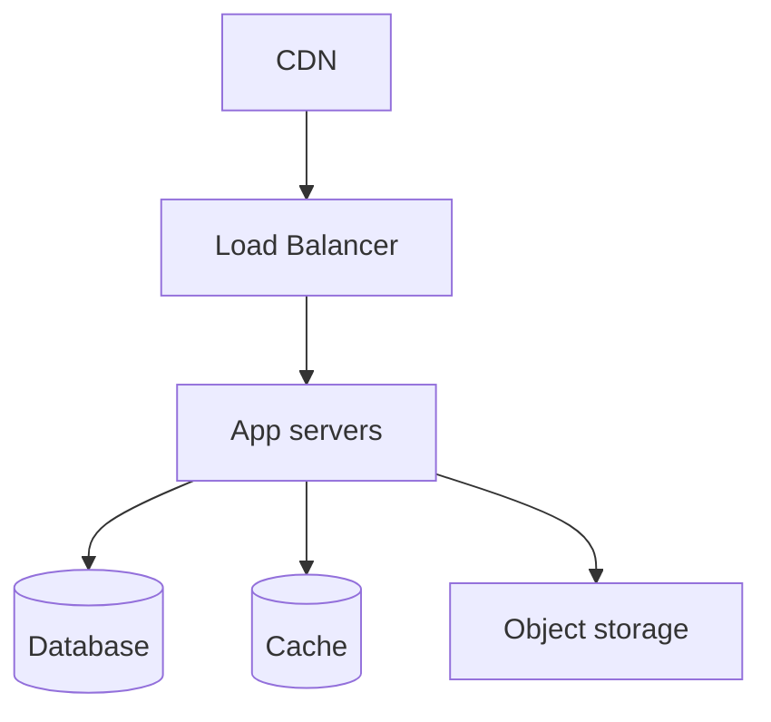

# /handover-deployment — Deployment & Infrastructure Runbook

Produces deliverable **04**: the operational runbook that lets the receiving team build, deploy, roll back, and operate the system in production without the original team. This is the doc that prevents 2 a.m. panic.

> **Shared contract** — output location & numbering, secrets → doc 05, actual-state-not-plan, cross-referencing, and completeness rules live in [`handover/references/handover-conventions.md`](../handover/references/handover-conventions.md). Follow it; don't restate it.

## When to use

- The client (or a new ops team) will own running the system in production.
- You must document how to deploy, what infra exists, and how to recover from failure.

## Inputs to gather (scan first)

- CI/CD config (`.github/workflows`, `.gitlab-ci.yml`, etc.), build scripts, `Dockerfile`/compose.
- Infra-as-code (Terraform, CloudFormation, Pulumi, k8s manifests) and the hosting provider.
- `.env.example` and the full list of required env vars / config (values live in doc 05).
- Domains, DNS, SSL/cert setup; CDN; load balancer.
- Backup jobs, monitoring/alerting, log destinations.

## Process

1. Document **environments** (local/dev/staging/prod): URLs, purpose, who has access, how they differ.
2. Draw the **infrastructure topology**: hosting, compute, datastore, networking, CDN, external services.
3. Document the **CI/CD pipeline**: triggers, stages, where artifacts go, required secrets.
4. Write **step-by-step deploy** and **rollback** procedures — copy-pasteable and validated by a dry run if possible.
5. List all **environment variables / config** (name + purpose + source; never the value).
6. Document **domains, DNS, SSL** including renewal and registrar.
7. Document **backups & disaster recovery**: what's backed up, frequency, retention, restore procedure (and test it).
8. Document **monitoring, logging, alerting**: dashboards, alert routes, on-call expectations.
9. Note **scaling & cost** levers and known limits.

## Output template — `handover/04-deployment-runbook.md`

```markdown
# Deployment & Infrastructure Runbook — <Project Name>

## 1. Environments

| Env | URL | Purpose | Hosting | Access |
|-----|-----|---------|---------|--------|
| Production | | | | |
| Staging | | | | |
| Dev / local | | | | |

## 2. Infrastructure topology

<Provider(s), regions, account IDs (see doc 05), key resources.>

## 3. CI/CD pipeline
- **Trigger:** <push to main / tag / manual>
- **Stages:** <lint → test → build → deploy>
- **Where it runs:** <provider>  ·  **Required secrets:** <names, sourced from doc 05>
- **Artifacts:** <registry / bucket>

## 4. Deploy procedure
1. <command / action>
2. <command / action>
3. Verify: <healthcheck URL / smoke test>

## 5. Rollback procedure
1. <how to identify the last good release>
2. <command to roll back>
3. Verify and communicate.

## 6. Environment variables / config

| Variable | Purpose | Required | Source (doc 05) |
|----------|---------|----------|-----------------|
| `DATABASE_URL` | | Yes | vault: `<ref>` |
| `...` | | | |

> Values are NOT listed here. Retrieve them from the secure vault referenced in doc 05.

## 7. Domains, DNS & SSL

| Domain | Registrar | DNS provider | Records | SSL / cert | Renewal |
|--------|-----------|--------------|---------|-----------|---------|
| | | | | | |

## 8. Backups & disaster recovery
- **What:** <db, files>  ·  **Frequency:** <...>  ·  **Retention:** <...>  ·  **Location:** <...>
- **Restore procedure:** <steps>  ·  **Last tested:** <date>
- **RTO / RPO:** <targets>

## 9. Monitoring, logging & alerting

| Concern | Tool | Where | Alert route |
|---------|------|-------|-------------|
| Uptime | | | |
| Errors | | | |
| Logs | | | |
| Metrics | | | |

## 10. Scaling & cost
<Scaling levers, known bottlenecks, current monthly cost and main drivers.>
```

## Quality checklist

- Deploy and rollback steps are concrete and have been dry-run if at all possible.
- Every env var is listed by name with its source; no secret values appear in the doc.
- The restore procedure has a "last tested" date — an untested backup is a liability, say so.
- DNS/SSL includes renewal ownership so certs don't silently expire after handover.
- Monitoring section says who gets alerted post-handover (us vs. client) — consistent with doc 08.
