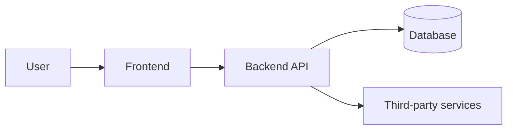

# /handover-tech — Technical Architecture

Produces deliverable **02**: the document a new engineer needs to understand, run, and safely change the system. It explains *how the system is built and why*, and gets a developer from zero to a running local environment.

> **Shared contract** — output location & numbering, secrets → doc 05, actual-state-not-plan, cross-referencing, and completeness rules live in [`handover/references/handover-conventions.md`](../handover/references/handover-conventions.md). Follow it; don't restate it.

## When to use

- Handing the codebase to the client's own engineers or a new vendor.
- The receiving team needs to maintain and extend the product without the original authors.

## Inputs to gather (scan the repo first)

- Languages, frameworks, runtimes and **pinned versions** (`package.json`, `pyproject.toml`, `go.mod`, `.nvmrc`, `Dockerfile`).
- Top-level structure and what each major directory/service is responsible for.
- Data stores, queues, caches, external services the app depends on.
- Existing `README`, `ARCHITECTURE.md`, `docs/`, ADRs, diagrams.
- Local setup steps actually needed to boot the app (verify them if possible).

## Process

1. Write a plain-language **system overview**: what the product does, its major components, and how requests/data flow between them.
2. Produce or describe an **architecture diagram** (Mermaid is fine — it renders in markdown).
3. Document the **tech stack with versions** and why each major choice was made.
4. Give a **repository map** — directory-by-directory, what lives where.
5. Capture **key design decisions / ADRs** — the non-obvious choices and their rationale and trade-offs, so the new team doesn't unknowingly undo them.
6. Summarize the **data model** (link to doc 03 for full schema if applicable).
7. Write **local setup** steps and verify they get the app running.

## Output template — `handover/02-technical-architecture.md`

```markdown
# Technical Architecture — <Project Name>

**Repository:** <url>  ·  **Default branch:** <main>  ·  **As of:** <commit / date>

## 1. System overview
<What it does and the major components. How a request flows end to end.>

## 2. Architecture diagram


## 3. Tech stack

| Layer | Technology | Version | Why / notes |
|-------|------------|---------|-------------|
| Frontend | | | |
| Backend | | | |
| Database | | | |
| Infra / hosting | | | |
| Build / CI | | | |
| Key libraries | | | |

## 4. Repository structure

| Path | Responsibility |
|------|----------------|
| `/src` | |
| `/public` | |
| `/...` | |

## 5. Key design decisions (ADRs)

### ADR-1: <title>
- **Context:** <problem / constraint>
- **Decision:** <what we chose>
- **Consequences / trade-offs:** <what this costs or precludes>

## 6. Data model overview
<Core entities and relationships. Full schema in doc 03 if applicable.>

## 7. Local development setup
1. Prerequisites: <runtime versions, tools>
2. Clone & install: `<commands>`
3. Environment: copy `.env.example` → `.env`, fill values (see doc 05 for sources)
4. Run: `<command>`  → app available at `<url>`
5. Tests: `<command>`

## 8. Coding conventions & gotchas
<Linting/formatting, branch strategy, anything surprising a new dev must know.>
```

## Quality checklist

- A new engineer could clone, configure, and run the app from section 7 alone.
- Versions are pinned and real, not "latest".
- ADRs explain the *why*, not just the *what* — the trade-off is stated.
- The repo map matches the actual tree.
- Secrets are referenced via doc 05, never embedded.
